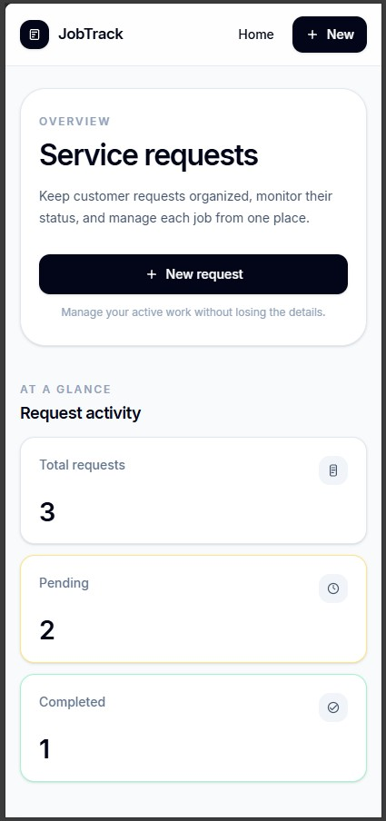
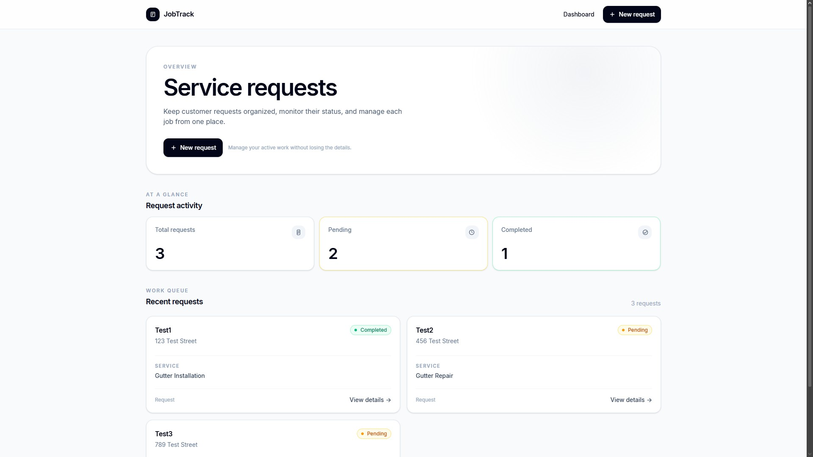
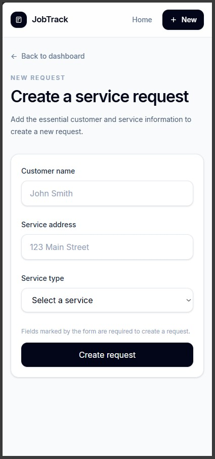
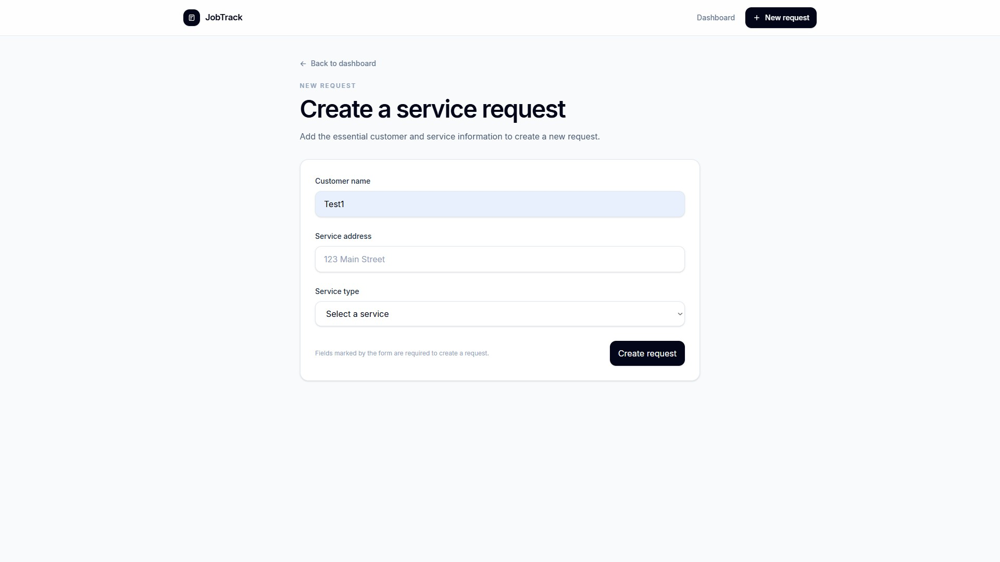
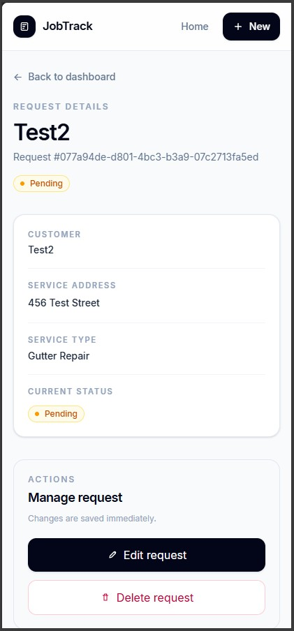
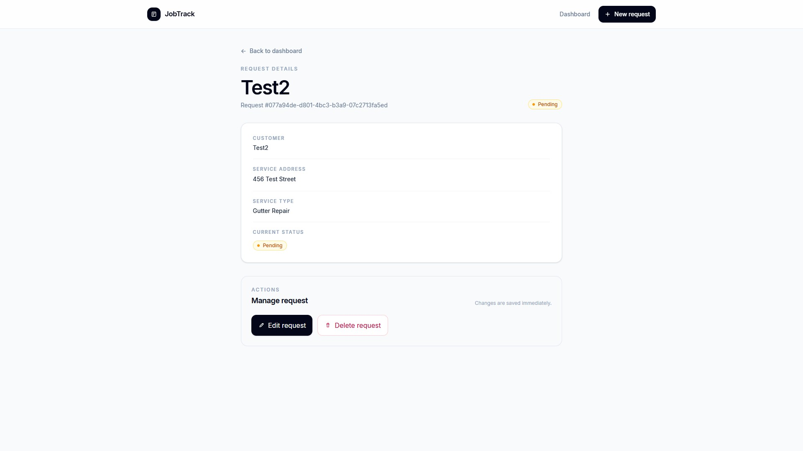

# Service Booking System

A fullstack service-request management application designed around the workflow of a small construction and field-service business.

The project was built as a practical fullstack engineering exercise, combining a layered Node.js/Express backend with a responsive React frontend while keeping the scope intentionally simple and avoiding unnecessary over-engineering.

## Preview

**Dashboard:**




**Create Request:**




**Request Details:**




## Overview

The Service Booking System allows a business to create, monitor, update, and remove customer service requests from a centralized interface.

The current MVP supports:

- Dashboard with request statistics
- Creation of new service requests
- Viewing individual request details
- Editing existing requests
- Updating request status
- Deleting requests
- Loading, empty, and error states
- Responsive mobile-first UI
- REST API communication between frontend and backend

## Tech Stack

### Frontend

- React
- React Router
- Tailwind CSS
- Vite
- JavaScript
- Modern responsive CSS
- CSS Container Queries
- `clamp()` for fluid typography and spacing

### Backend

- Node.js
- Express
- JavaScript
- Object-Oriented Programming
- REST API
- Layered architecture
- In-memory data storage
- CORS

## Architecture

The project is divided into two independent applications:

```text
service-booking-system/
│
├── frontend/
│   ├── src/
│   │   ├── components/
│   │   ├── hooks/
│   │   ├── pages/
│   │   ├── services/
│   │   ├── utils/
│   │   └── ...
│   └── ...
│
├── backend/
│   ├── src/
│   │   ├── controllers/
│   │   ├── data/
│   │   ├── middlewares/
│   │   ├── models/
│   │   ├── routes/
│   │   ├── services/
│   │   └── utils/
│   └── ...
│
└── README.md
```

### Backend request flow

```text
HTTP Request
     ↓
   Route
     ↓
 Controller
     ↓
  Service
     ↓
   Store
     ↓
   Model
```

The backend also uses centralized error handling through custom application errors and Express middleware.

### Frontend flow

```text
Page
 ↓
Custom Hook
 ↓
API Service
 ↓
REST API
 ↓
Express Backend
```

This keeps API communication separated from presentation and allows UI components to remain focused on their own responsibilities.

## API

The backend currently exposes:

| Method | Endpoint        | Description                 |
| ------ | --------------- | --------------------------- |
| GET    | `/requests`     | Retrieve all requests       |
| GET    | `/requests/:id` | Retrieve a specific request |
| POST   | `/requests`     | Create a request            |
| PATCH  | `/requests/:id` | Update a request            |
| DELETE | `/requests/:id` | Delete a request            |

### Example request

```json
{
  "name": "John Smith",
  "address": "123 Main Street",
  "serviceType": "gutter installation"
}
```

A newly created request receives a unique ID and starts with a `pending` status.

## Local Development

Clone the repository and install dependencies in both applications.

### Backend

```bash
cd backend
npm install
node src/server.js
```

The API runs on:

```text
http://localhost:3000
```

### Frontend

Open another terminal:

```bash
cd frontend
npm install
npm run dev
```

The Vite development server will provide the frontend URL.

The frontend can be configured to use the backend through:

```env
VITE_API_URL=http://localhost:3000
```

## Current Storage

The MVP intentionally uses an in-memory data store.

This keeps the application simple while demonstrating the complete fullstack flow:

```text
React
 ↓
HTTP
 ↓
Express
 ↓
Business logic
 ↓
In-memory store
```

Because the data is stored in memory, all requests are lost whenever the backend process is restarted.

Persistent storage can be introduced in a future iteration without changing the overall application architecture.

## Engineering Goals

This project focuses on practical software engineering rather than maximizing the number of technologies involved.

Some of the main goals were:

- Separation of concerns
- Maintainable project structure
- Object-oriented backend design
- RESTful API design
- Reusable React components
- Responsive and accessible UI
- Modern CSS techniques
- Clear frontend/backend boundaries
- Intentional abstraction instead of premature complexity

## Future Improvements

The MVP intentionally leaves room for future iterations.

Possible improvements include:

- Persistent database storage
- More detailed service-request information
- Search and filtering
- Better request history
- More advanced dashboard analytics
- Additional statuses
- Authentication and authorization
- Deployment
- Automated tests
- Improved API documentation

These features can be introduced gradually based on actual requirements rather than adding complexity without a clear purpose.

## Project Status

**Current status: MVP complete**

The application currently provides a complete frontend-to-backend request-management flow while keeping the implementation intentionally lightweight and easy to understand.

## License

This project is licensed under the MIT License.
